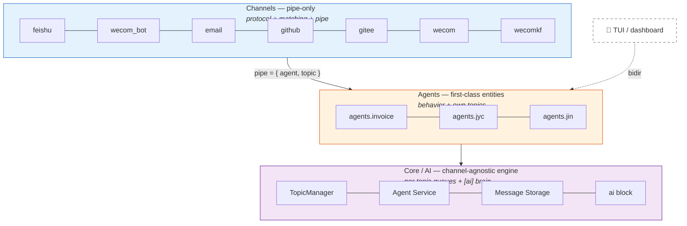
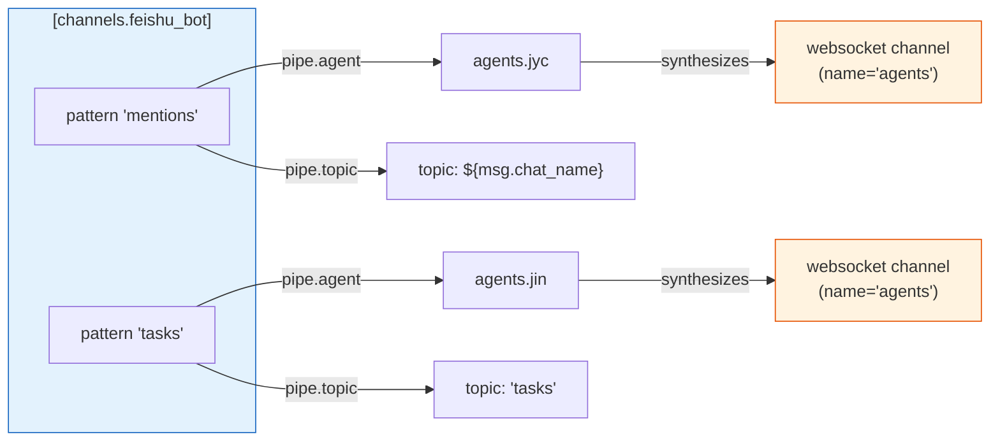
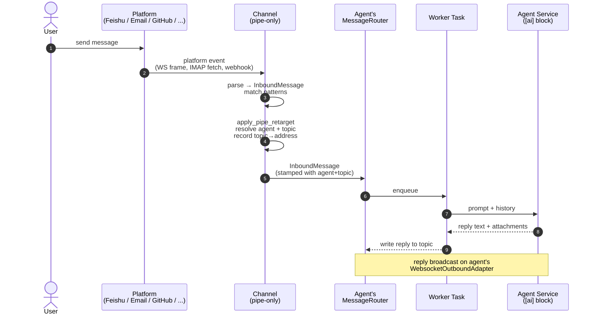
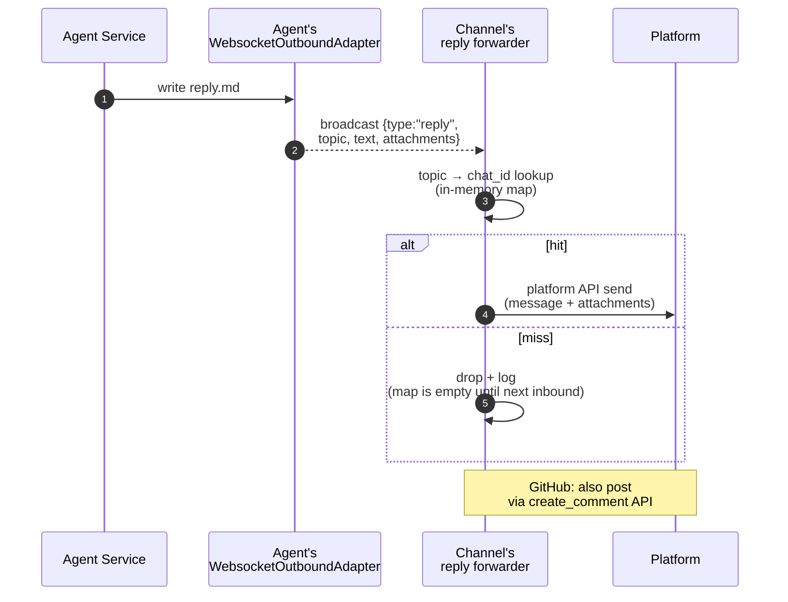
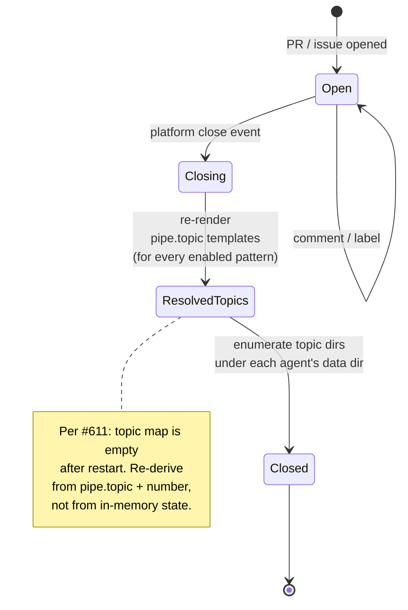

# Channels, Agents, and AI — The Pipe Architecture

**Status:** Reached. Feishu, wecom_bot, email, github, gitee, wecom, and
wecomkf are all pipe-only channels — every channel type other than the
synthesized agent websocket is a pipe-only channel. WeChat was removed
instead of migrated (no production use, no migration path).

## Context

Historically, every JYC channel type was a full channel: its own inbound
adapter, pattern matcher, MessageRouter, TopicManager, agent service, state
manager, and outbound adapter. Each new channel re-implemented the same
plumbing, and channel-specific behavior leaked into places it didn't belong.

The pipe architecture splits the system into three layers with strict
responsibilities:



## Layer 1 — Channels (pipe-only)

A channel speaks exactly one platform protocol and nothing else.

**A channel MUST:**

- translate platform events into `InboundMessage` (with platform metadata:
  chat_id, chat_name, mentions, sender),
- match its own patterns and re-target matching messages into an agent
  channel via `pipe = { agent, topic?, pattern? }`,
- record the resolved agent topic → platform address mapping for reply relay,
- subscribe to the pipe target's broadcast and relay replies (text +
  attachments) back to the platform.

**A channel MUST NOT:**

- create a TopicManager, agent service, or outbound adapter,
  and no conversation state manager (a *protocol* cursor is allowed — see
  email's IMAP `StateManager`),
- store conversation history or own topics,
- appear in the channel orchestrator / dashboard channel list.

A matched pattern without `pipe` is a configuration error: the message is
dropped with a warning at runtime, and startup logs a warning for each such
pattern.

## Layer 2 — Agents

An agent is a first-class entity declared under `[agents.<name>]`. Each
agent synthesizes a websocket channel — the **only** channel type that owns
topics, routing, and agent wiring.

- `[agents.<name>]` produces a websocket channel (`channel_type = "websocket"`,
  `channel_name = "agents"`) with one implicit pattern per agent.
- Inbound adapter + outbound broadcast bus (`tokio::sync::broadcast`) per
  agent channel.
- Replies are broadcast as `{"type":"reply","topic","text","attachments":[...]}`
  payloads.
- Humans (TUI, dashboard chat panes) and pipe-only channels are symmetric
  spokes of the agent: both submit messages into topics and both can
  subscribe to replies.



## Layer 3 — Core / AI

The core is channel-agnostic. It never sees platform-specific data — only
`InboundMessage`, topics, and reply text.

- Per-topic message queues drained by worker tasks; concurrency bounded by a
  semaphore.
- Agent service (in-process agent), message storage, template resolution, job
  scheduler.
- One core instance per agent channel; pipe-only channels have no core
  presence.
- The single `[ai]` block is the shared brain — model providers, prompts,
  thinking, iteration limits, applied uniformly to every agent.

### Context shaping

How a topic's per-message JSONL history is sliced and shaped for the LLM
request is governed by the context strategy — a separate concern from the
layer architecture itself.

**See [Context](context.md)** for the full treatment: data plane, `full`
vs `sliding_window`, the ①②③ regions, `note_window`, `tool_result_cap`,
token safety nets, and override files.

## Message flow

**Inbound** (feishu example):



**Outbound:**



Proactive sends follow the same path: `jyc_send_message` to an agent channel
broadcasts a `reply` payload keyed by topic, which the channel's forwarder
relays. Known limitation: the topic→address mapping is in-memory and rebuilt
on inbound traffic, so proactive sends right after restart are dropped until
the next inbound message. Persisting the mapping (e.g. a `.jyc/` file in the
topic directory) is a planned follow-up.

## Design rules

1. Core MUST NOT contain platform-specific code.
2. The agent (its synthesized websocket channel) is the only place where
   topics, behavior, and templates exist.
3. New platform support = new pipe-only channel, never a new full channel.
4. Channels run **in-process** today (in-process re-targeting + broadcast
   subscription). The channel↔agent seam — the pipe re-target contract and
   the broadcast payload schema — is the designated boundary where an
   **external-process channel** (e.g. a Node.js adapter connecting over real
   WebSocket) may attach in the future. Changes to this seam must keep that
   option open; do not couple channels to core internals beyond this contract.

## Feishu — first migration

Feishu is the reference implementation. After cleanup, the channel retains
only:

- `client.rs` — Feishu API client (send text/image/file, upload, name lookups)
- `websocket.rs` — event stream → `InboundMessage`
- `inbound.rs` — pattern matching (`FeishuMatcher`)
- pipe wiring in `jyc-cli/src/cli/serve/channels.rs` — re-targeting, address
  mapping, reply forwarder

Removed in the migration: `FeishuOutboundAdapter` (direct-mode delivery),
`formatter.rs` and `validator.rs` (never wired in), the non-pipe routing
fallback, the channel's own TopicManager/agent/state/orchestrator
registration, and topic-close handling (a no-op for piped topics).

## WeCom Bot — second migration

`wecom_bot` (WeCom Smart Robot, WebSocket long connection) follows the
same pipe-only migration as feishu. The channel retains only:

- `client.rs` — WebSocket lifecycle (connect, subscribe, heartbeat, reconnect).
- `inbound.rs` — WebSocket frames → `InboundMessage` (with attach-download via
  `media::process_bot_attachments` for image/file/mixed).
- `outbound.rs` — wire-format helpers only (streaming reply, attachment
  upload, media body), re-exported as `pub` so the pipe channel drives
  them directly.
- The new `spawn_wecom_bot_adapter` in `crates/jyc-cli/src/cli/serve/channels.rs`.

Removed in the migration: the `WecomBotOutboundAdapter` registration in
`build_outbound_adapter`, the `"wecom_bot"` arm in `InboundSpawner::spawn`,
the `wecom_bot_handle_arc` plumbing, and the channel-specific processing
indicator / progress spinner code in `TopicManager::worker` (the core
stays channel-agnostic — the pipe channel owns the streaming reply).
The `WecomBotOutboundAdapter` struct itself was deleted afterwards
(#599) — with the pipe channel driving the free functions, nothing
constructed it.

**Placeholders.** Unlike feishu, wecom_bot does not populate a
`chat_name` on the inbound message. The pipe topic template uses
`${msg.<key>}` against any metadata key (channel_uid, chatid, userid,
chat_name, ...) — `channel_uid` unifies group chat (chatid) and single
chat (userid) in one template (`topic = "bot-${msg.channel_uid}"`).

**Streaming reply.** Because the WeCom passive reply window is short and
the agent can take minutes, the channel sends a `finish=false` streaming
indicator immediately on inbound (the user-visible "thinking…" message).
The reply forwarder completes the stream with `finish=true` and sends
any attachments via proactive `aibot_send_msg` (no window constraint).

## Email — third migration

Email (IMAP in, SMTP out) follows the same pipe-only migration. The channel
retains only:

- `jyc-services/src/imap/` — IMAP client, monitor loop (IDLE/poll), raw email
  parsing. The monitor takes an `on_message` callback (like
  `InboundAdapterOptions::on_message`) instead of owning a router + matcher.
- `jyc-services/src/smtp/client.rs` — SMTP wire format (reply threading,
  attachments).
- `jyc-channels/src/email/inbound.rs` — pattern matching only (`EmailMatcher`).
- The new `spawn_email_adapter` in `crates/jyc-cli/src/cli/serve/channels.rs`.

Removed in the migration: `EmailOutboundAdapter` (whole file), the dead
`EmailInboundAdapter` + duplicate `parse_raw_email` in `email/inbound.rs`,
`email_parser::build_full_reply_text`, and the `"email"` arms in
`build_outbound_adapter` / `InboundSpawner::spawn`.

**Mailbox cursor state.** Unlike feishu/wecom_bot, the email channel keeps a
`StateManager` at `<workdir>/channels/<channel_name>/.imap/` — the IMAP
sequence number + processed UIDs. That is protocol-level dedup state, not
conversation state, so it stays with the channel. `--reset` clears it;
`--no-idle` forces poll mode. (The generic per-channel `StateManager` in
`serve/mod.rs` went away with this migration: email was its only consumer.)

**Topic identity.** Email's natural topic is its subject, so a `pipe` without
an explicit `topic` falls back to the subject-derived topic name
(`EmailMatcher::derive_topic_name`, i.e. prefixes stripped). An explicit
`pipe.topic` (including `${msg.<key>}` templates) wins.

**Placeholders.** Email populates `from` (sender address) and `in_reply_to`
metadata; `${msg.channel_uid}` is the IMAP UID (per-message — not a usable
topic). The useful email keys are `${msg.from}` (one topic per sender) and
`${msg.topic}`, which resolves to the subject-derived name: `Re:`/`Fw:`/
`回复:`/`转发:` prefixes are stripped at parse time
(`email_parser::strip_reply_prefix`), configured pattern prefixes and
filesystem sanitization by `derive_topic_name`. So `topic = "mail-${msg.topic}"`
turns a `Re: Fw: Invoice 42` subject into the topic `mail-Invoice 42`. The
channel sets `message.topic` to the derived name before retargeting, which is
what makes the placeholder see the pattern-stripped value.

**Reply threading.** The forwarder keeps a `topic → { recipient, subject,
in_reply_to, references }` map recorded on inbound, so replies land in the
original mail thread (`In-Reply-To` = original `Message-ID`, `References` =
original chain + `Message-ID`). Same in-memory limitation as feishu: rebuilt
from inbound traffic after a restart, and two senders sharing one subject
share one entry (last writer wins).

**No footer.** Email replies are plain agent text (trailing `---` separators
stripped); the model/mode/token footer is gone, so `[channels.<name>.footer]`
no longer applies to email channels. Per-pattern
`[channels.<name>.patterns.attachments]` also stops applying at route time
(the agent channel's patterns are matched there) — the global
`[attachments.inbound]` policy still applies, same as feishu/wecom_bot.

## GitHub

GitHub (REST polling in, issue/PR comments out) follows the same pipe-only
migration, plus a deeper refactor: no initialization templates and no shared
repo directories.

Retained:

- `jyc-channels/src/github/client.rs` — REST client (polling + comment posting).
- `jyc-channels/src/github/inbound/` — the poller (`poll.rs`), dedup/cursor
  state (`state.rs`), and `GithubMatcher` (reviewer-priority pattern ordering,
  topic-name derivation).
- The new `spawn_github_adapter` in `crates/jyc-cli/src/cli/serve/channels.rs`.

Removed: `GithubOutboundAdapter` (whole file), the `"github"` arms in
`build_outbound_adapter` / `InboundSpawner::spawn`, and — repo-wide — the
`repo_group` shared-repo feature.

**Dedup/cursor state.** Like email, the channel keeps its own protocol state,
at `<workdir>/channels/<channel_name>/.github/` (processed comments, seen
issues, CI status, close-event notifications). A one-time rename migrates the
old `<workdir>/<channel_name>/.github/` location on first start; if the rename
fails, dedup starts fresh — the comment cursor starts at startup so no comment
flood, but already-open issues/PRs re-trigger once as "opened" events, as on a
first deploy.

**Placeholders.** GitHub messages populate `repo`, `github_number`,
`github_type` (`pull_request` / `issue`), `github_action`, `github_labels`,
`github_assignees`, plus `pr_number` **or** `issue_number` — type-gated, so a
PR event carries only `pr_number` and an issue event only `issue_number`. That
gating is deliberate: a planner pattern configured with
`topic = "plan-${msg.issue_number}"` that accidentally matches a PR event fails
placeholder resolution and drops the message with a warning, instead of
silently landing PR traffic in an issue topic.

Typical routing — three roles, one agent, one topic per item per role:

```toml
pipe = { agent = "jyc_git", topic = "review-${msg.pr_number}" }   # review pattern
pipe = { agent = "jyc_git", topic = "dev-${msg.pr_number}" }      # develop pattern
pipe = { agent = "jyc_git", topic = "plan-${msg.issue_number}" }  # planner pattern
```

Collapsing roles into one shared topic is purely a config choice: give the
patterns the same `topic` template. Splitting them is the same choice inverted
— the framework does not care.

**Cross-repo collision is the operator's responsibility.** A template like
`review-${msg.pr_number}` has no repo qualifier, so two GitHub channels piping
into the same agent both map their PR #5 onto `review-5` — and both forwarders
then comment on their own repo for every reply in that topic. Qualify the topic
(`review-${msg.repo}-${msg.pr_number}`) or give each repo its own agent.

**Reply relaying.** The forwarder keeps a `topic → (number, role)` map recorded
on inbound and posts replies as comments via `create_comment`. The `[Role]`
prefix is preserved — it is also how the poller recognizes its own comments and
avoids self-loops (`extract_comment_role`). There is **no** model/mode/token
footer, and GitHub comments carry no attachments (reply attachments are
ignored, same as before the migration). Same in-memory limitation as the other
channels: the map is rebuilt from inbound traffic after a restart.

**Close events.** A closed issue/PR must close the topics in the *agent's*
workspace, which a pipe-only channel cannot find by scanning its own
(nonexistent) workspace. `InboundAdapterOptions` therefore carries an
`on_close_event: CloseEventCallback` (item number + `issue` /
`pull_request`). The topic name is a pure function of `pipe.topic` and the
number, so the channel re-renders every enabled pattern's topic template for
that number instead of trusting memory: the in-memory topic map is empty after
a restart, so a close event for an item routed before the restart used to close
nothing (#611). Both sources are unioned, so `review-5` and `dev-5` still close
together. Only number-dependent templates participate — a static `pipe.topic`
collects many items into one shared topic that must survive any single item
closing — and `${msg.pr_number}` / `${msg.issue_number}` stay type-gated as at
routing time, so an issue close never resolves a PR topic. Each agent channel
carries a `(MessageRouter, TopicManager)` pair; the close-event handler
reaches the agent's TopicManager through the agent registry. wecom keeps
using the name-based `on_topic_close` and is unaffected. Feishu reports
`im.chat.disbanded_v1` over the same callback (carrying the upstream chat_id);
the serve layer reverse-maps it via its topic→chat_id relay map and closes
every piped topic for that chat. **All** auto-close paths funnel into
`TopicManager::auto_close_topic`, which deletes only directories that resolve
under the agents workspace root (`<data_home>/agents/`) — topics pinned to a
custom `topic_path` (e.g. a real project checkout) are skipped with an info
log, and canonicalization blocks symlink escapes. Manual `/close` (with
`--confirm`) still uses the unguarded `close_topic`.



**No templates — initialization is a skill.** GitHub/Gitee patterns no longer
inject a `template`; the agent initializes its own topic directory by following
an init skill. Skills are discovered from the layered skill roots, so
`{workdir}/skills/<name>/SKILL.md` is visible to every topic — that is where the
init skill belongs. Note that per-pattern `skills`, `mode`, and `attachments`
settings on GitHub/Gitee patterns stop applying (the agent channel's patterns
are matched at route time), same as the other pipe-only channels. The `template`
machinery itself stays for wecom.

Two ready-made skills ship in `skills/`; copy them into `{workdir}/skills/`:

| skill | job |
|---|---|
| `github-init` | Clones the repository **into the topic directory itself** (not a `repo/` subdirectory), and excludes framework files via `.git/info/exclude`. |
| `github-planner` | The planner role, ported from `templates/github-planner/AGENTS.md`; delegates setup to `github-init`. |

The trigger message already carries `repository: <owner>/<repo>` and the item
number (see `build_trigger_message`), so the init skill needs no extra plumbing —
it reads the repository straight out of the message body. Because it is a skill
rather than a template, editing it does not require a jyc restart.

Cloning into the topic root rather than a `repo/` subdirectory means the
repository's own `AGENTS.md` lands at the topic root, where the prompt builder
already loads it as project instructions on every turn — a stronger guarantee
than a skill that must first be triggered. Repository-shipped skills under
`.claude/skills/`, `.opencode/skills/`, and `.jyc/skills/` are likewise picked up
by the existing topic-root scan.

## Gitee

Gitee (REST polling in, issue/PR comments out) follows the same pipe-only
migration as GitHub: no initialization templates, no shared repo directories,
topics live in the pipe target (agent) channel.

Retained:

- `jyc-channels/src/gitee/client.rs` — REST client (polling + comment posting).
- `jyc-channels/src/gitee/inbound.rs` — the poller, dedup/cursor state, and
  `GiteeMatcher` (pattern ordering, topic-name derivation).
- The new `spawn_gitee_adapter` in `crates/jyc-cli/src/cli/serve/channels.rs`.

Removed: `GiteeOutboundAdapter` (whole file, plus its inclusion in `mod.rs`),
and the `"gitee"` arms in `build_outbound_adapter` / `InboundSpawner::spawn`.

**Dedup/cursor state.** Like GitHub, the channel keeps its own protocol state,
at `<workdir>/channels/<channel>/.gitee/` (processed comments, seen issues,
close-event notifications). A one-time rename migrates the old
`<workdir>/<channel>/.gitee/` location on first start; if the rename fails,
dedup starts fresh — the comment cursor starts at startup so no comment flood,
but already-open issues/PRs re-trigger once as "opened" events, as on a first
deploy.

**Placeholders.** Gitee messages populate `repo`, `gitee_number`,
`gitee_type` (`pull_request` / `issue`), `gitee_action`, `gitee_labels`,
`gitee_assignees`, plus `pr_number` **or** `issue_number` — type-gated exactly
as on GitHub (see `build_trigger_message`).

**Reply relaying.** The forwarder keeps a `topic → (number, role, is_pr)` map
recorded on inbound and posts replies as comments via the Gitee API. The
`[Role]` prefix is preserved (self-loop prevention). There is **no**
model/mode/token footer, and Gitee comments carry no attachments. Unlike
GitHub, Gitee uses **separate number spaces for issues and PRs**, so the map
records the item type; the close-event handler filters remembered topics by
type as well as number, so closing issue #5 never touches a PR #5 topic.

**Close events.** A closed issue/PR re-renders every enabled pattern's topic
template for that number via `close_event_topics` (same restart-proof logic as
GitHub) and unions the in-memory routed topics (type-filtered). The agent's
`TopicManager` is reached through the agent registry.

**No templates — initialization is a skill.** Same design as GitHub; the
skills are `gitee-init` (plain `git clone` — Gitee has no `gh` CLI),
`gitee-planner`, and `gitee-developer`, all in `skills/`.

## WeCom (group bot callback) — migration

Retained:

- `server.rs` / `crypto.rs` — the shared webhook server and AES helpers,
  still shared with wecomkf.
- `inbound.rs` — webhook XML → `InboundMessage` translation and the
  `WecomMatcher` (pattern match only; no routing ownership).
- `outbound.rs` — reduced to `WecomSender`, a stateless external-contact
  API sender (text/markdown auto-detect).
- The new `spawn_wecom_adapter` in `crates/jyc-cli/src/cli/serve/channels.rs`:
  pipe retarget, an in-memory `topic → chat_id` relay map, and one reply
  forwarder per pipe target channel.

Removed: `WecomOutboundAdapter` (full-channel OutboundAdapter impl), the
`wecom` arms in `build_outbound_adapter` / `InboundSpawner`.

## WeCom KF (customer service) — migration

Retained:

- `server.rs` / `crypto.rs` — shared with wecom (above).
- `kf_client.rs`, `kf_cursor.rs`, `kf_dedup.rs`, `token_cache.rs` — the
  `sync_msg` pull protocol plus cursor/dedup state (protocol state, same
  precedent as email's IMAP cursor and github's dedup store).
- `kf_inbound.rs` — `kf_msg_or_event` notification → `sync_msg` pull →
  `InboundMessage`, plus the `WecomKfMatcher`. Metadata keys available for
  `pipe.topic` placeholders: `${msg.open_kfid}`, `${msg.external_userid}`,
  `${msg.user_name}`.
- `kf_outbound.rs` — reduced to `send_kf_text` (`kf/send_msg` with the
  95001 rate-limit retry).
- The new `spawn_wecomkf_adapter`: pipe retarget, an in-memory
  `topic → (open_kfid, external_userid)` relay map, reply forwarders.

Removed: `WecomKfOutboundAdapter`, the `wecomkf` arms in
`build_outbound_adapter` / `InboundSpawner`, and the shared
`wecomkf_kf_client` plumbing in `serve` (the channel builds its own
`KfApiClient`). The `channel == "wecomkf"` special-case in
`chat_log_store` was generalized — topic.json `user_name` fallback now
applies to every channel.

Replies stay text-only: attachments were already ignored by the
pre-migration outbound adapter, and the migration keeps that behavior.

Known limitation (same as every other pipe channel): the relay maps are
in-memory, so after a daemon restart a reply to a topic whose last
inbound message predates the restart is skipped until the user speaks
again. The pre-migration KF adapter had a topic.json fallback for this;
post-migration it is dropped deliberately — the agent topic still records
`open_kfid`/`external_userid` in topic.json (written by the core
worker), so a future fallback can be built without protocol changes.

Startup credential checks (`verify_connectivity`) run as background
tasks at spawn time and log errors, replacing the pre-migration
fail-fast `connect()`.

## Migrating new channels

None left — all channel types are pipe-only now. New channel types must
be born pipe-only: protocol code + matcher + pipe wiring, no
TopicManager/agent/outbound-adapter registration.

## See also

- [Context](context.md) — how each agent shapes its LLM request
- [`DESIGN.md`](../DESIGN.md) — system architecture overview
- [`config.example.toml`](../config.example.toml) — full config reference
- [`agents.example.md`](../agents.example.md) — `[agents.<name>]` reference
- [`docs/channels/*.md`](../channels/) — per-channel setup guides