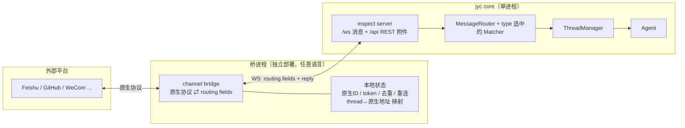
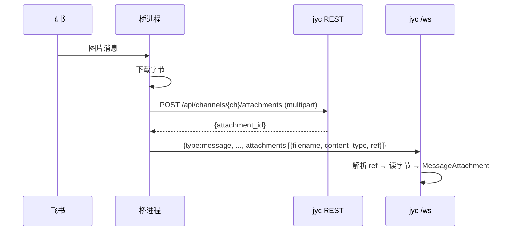
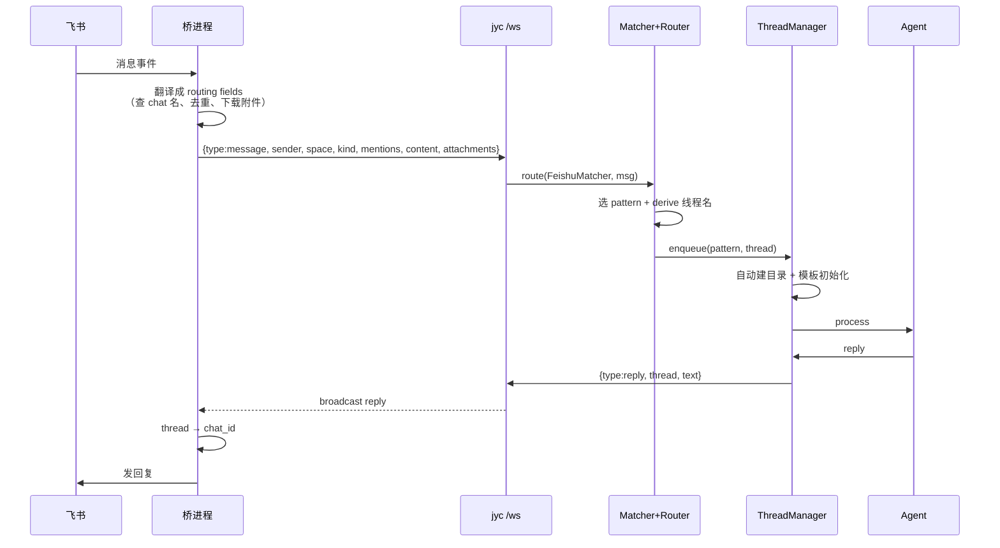
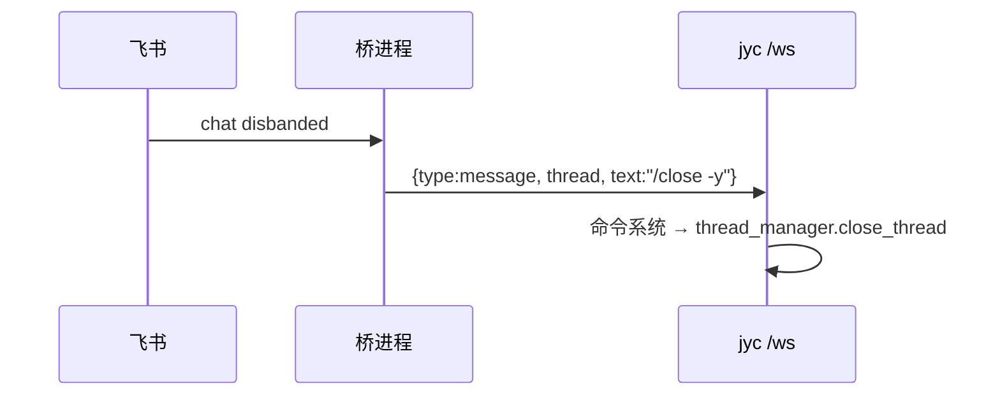

# JYC 插件化架构（Channel Plugin Architecture）

> 状态：设计提案（Draft）— 尚未实现

## 1. 动机

今天所有 channel 都编译进同一个二进制，`jyc-cli` 用两个硬编码的 `match channel_type` 装配
（`build_outbound_adapter` + `InboundSpawner::spawn`，约 950 行）。结果是：core 二进制绑定
openlark / lettre / mail-parser / wechat crypto 等全部依赖；新增 channel 要重编、重启；
channel 只能用 Rust 写。

目标：**把 channel 从 core 里剥成独立进程（bridge / plugin）**，channel 与 jyc、甚至与 Rust
解耦。core 只保留一种 channel（WebSocket），其它 channel 通过桥进程把消息 forward 进 WS、
再把回复 relay 回原生端。

## 2. 设计决策总览

| # | 决策 | 结论 |
|---|------|------|
| 1 | 传输层 | WS（复用 inspect server 的 `/ws/<channel>`，同端口已挂 REST） |
| 2 | 匹配 | matcher 留在 core，由 channel 的 `type` 选择；桥不知道 pattern |
| 3 | 线上内容 | 只传 routing fields + 附件引用；与路由无关的一律不发 |
| 4 | 桥持有状态 | 原生 ID、token、去重、重连、`thread↔原生地址` 映射全留桥 |
| 5 | 附件 | REST + multipart 上传/下载，WS 只传 `attachment_id` 引用 |
| 6 | 线程关闭 | 复用 `/close -y` 命令，桥发 WS 消息触发，零新协议 |
| 7 | 配置 | `type` 保留（选 matcher），新增 `transport = "ws"` 标记；channel 特定配置移桥 |
| 8 | repo_group 软链 | **不支持**，不进 bridge 模型 |
| 9 | 跨线程/主动发消息 | 已在 ThreadManager 层、channel 无关，零改动 |
| 10 | 桥生命周期 | MVP 外部管理 → 可选 jyc-spawn，配置形状对齐 MCP Local/Remote |
| 11 | 鉴权 | spawn 桥 token 走 env 自动注入；外部桥读 token 文件 |
| 12 | 发现 | `~/.config/jyc/bridges/<name>/config.toml` 清单自动扫描 |
| 13 | repo | `bridges/` 目录 + 单向依赖（桥不 link core） |
| 14 | 试点 | 先 Rust 剥 feishu，再谈非 Rust 与其它 channel |

## 3. 架构总览



**边界**：桥把「channel 原生世界」压缩成「routing 事实 + 附件引用」发给 jyc；jyc 把
「回复 + thread 名」发回；桥再把 thread 名展开回原生世界。**两个方向都没有第三层。**

## 4. 核心概念

- **Bridge / Plugin**：一个说 WS + JSON + multipart 的普通 WS 客户端。不注册、不发现，
  契约就是 WS 协议，与语言无关。
- **routing fields**：决定「哪个 pattern、哪个线程名」的最小事实集，是线上唯一的内容。
- **`type` 选 matcher**：用哪个 matcher 由 channel 的 `type` 决定，不由 payload 决定。
  同一 `/ws/<channel>` 端点服务 dashboard（`type="websocket"`，只发 `{thread, text}`）
  和 feishu 桥（`type="feishu"`，发完整 routing fields）。
- **thread 名是关联键**：回复按 `thread` 广播，桥本地映射回原生地址。jyc 全程不知道
  chat_id 存在。
- **线程目录自动创建**：thread 不存在时，第一条消息即建目录（`ThreadManager` 层，
  channel 无关，见 `thread_manager/queue.rs` 的 `create_dir_all`）。**桥无需 create 原语。**

## 5. Routing Fields

`PatternRules` 已经收敛到 8 个路由维度，只是命名被 channel 污染（`chat_name` vs
`github_type` vs `gitee_type`）。规范化后：

| 字段 | 含义 | 映射来源 |
|------|------|---------|
| `sender` / `sender_address` | 谁发的 | open_id / github login / wecom userid / email addr |
| `space` | 会话/空间标识 | feishu `chat_name`、github `repo`、wecom `chatid`、wechat `group` |
| `kind` | 实体类型 | `github_type`/`gitee_type`(issue/pr)、`chat_type`(group/p2p) |
| `subject` | 主题/标题 | email subject、issue title |
| `mentions` | @到谁 | feishu mentions、wechat @ |
| `labels` | 标签 | github/gitee labels |
| `assignees` | 指派给谁 | github/gitee assignees |
| `content` | 正文（`keywords` 规则对之匹配） | 全 channel |

**非路由的（原生 ID、token、事件去重 ID、`thread↔地址` 映射）一律留桥，不上线。**
缺失字段 = 该规则不命中（现有 matcher 语义，`feishu_match_message` 已如此）。

## 6. Wire 协议

### 6.1 入站（桥 → jyc）

```json
{
  "type": "message",
  "sender": "张三",
  "sender_address": "ou_abc",
  "space": "绿色农场",
  "kind": "group",
  "subject": null,
  "mentions": [{"id": "ou_bot", "name": "jyc"}],
  "labels": [],
  "assignees": [],
  "content": "帮我改个配置",
  "attachments": [{"filename": "a.png", "content_type": "image/png", "ref": "att_1"}]
}
```

- 全部 optional。dashboard 的 chat pane 只发 `{type:"message", thread, text}`（最小编码）。
- 线程名由 matcher 从 routing fields 派生（主用 `space`），与今天 `derive_thread_name` 一致。

### 6.2 出站（jyc → 桥）

```json
{
  "type": "reply",
  "thread": "绿色农场",
  "text": "已改好",
  "attachments": [{"filename": "out.pdf", "content_type": "application/pdf", "ref": "att_9"}]
}
```

广播按 `thread` 关联；桥本地映射回原生地址。**一个 channel 一个桥**（外加只读 dashboard
观察者即可）。

## 7. 附件流（REST + 引用）



- 二进制走 multipart（Slack / Discord / Telegram / 飞书同款），WS 只传引用。
- 出站方向对称：jyc 广播 `ref`，桥 `GET /api/channels/{ch}/attachments/{id}` 下载再上传飞书。
- 不 base64 塞 WS：避免队头阻塞 + 33% 膨胀 + 中文文件名 header 编码坑。

## 8. 端到端生命周期



## 9. 线程关闭



复用现有 `/close` 命令（需 `-y` / `--confirm` 确认，见 `jyc-core/src/command/close_handler.rs`），
协议零改动。

## 10. 配置

```toml
# jyc config.toml（改动最小）
[channels.feishu_bot]
type = "feishu"        # 保留 → 继续用 FeishuMatcher，mentions/chat_name 规则原样生效
transport = "ws"       # 新增 → 传输走 WS 桥，而非编译进 core 的 openlark

[[channels.feishu_bot.patterns]]   # 100% 原样
name = "feishu_bot"
[channels.feishu_bot.patterns.rules]
mentions = ["jyc"]
```

```toml
# ~/.config/jyc/bridges/feishu/config.toml（清单 + 桥自己的配置，一份文件两用）
name = "feishu"
channel_type = "feishu"           # jyc 只读这个 + command
command = ["feishu-bridge"]       # 有则 spawn；无则等外部连接
app_id = "cli_xxx"                # 桥自己读
app_secret = "xxx"
base_url = "https://open.feishu.cn"
```

`[channels.X.feishu]` 整块（app_id / secret / base_url / websocket / events）移桥；
`patterns` / `agent` / `model` / `footer` / `mcps` 等 channel 无关配置零改动。

## 11. 生命周期与鉴权

- **spawn 桥**：jyc 启动时扫 `~/.config/jyc/bridges/*/config.toml`，按 `channel_type` 匹配
  启用的 ws channel；有 `command` 就 spawn，token 走 env 自动注入（jyc 内存里已有，
  `serve/mod.rs` 启动时 `generate_token()`）；崩溃带退避重启；关闭 `kill_on_drop`
  （dashboard 自动起 serve 已有此模板）。
- **外部桥**：无 `command`，jyc 只等连接；桥自己读 token 文件（`token_path(workdir)`）
  或 `jyc token show`。
- 配置形状对齐 MCP 的 `Local{command, environment}` / `Remote{url}`。
- 只 spawn「`channel_type` 匹配某个启用 ws channel」的桥，不无条件执行目录里的可执行文件。

## 12. 发现：`~/.config/jyc/bridges/`

照搬 skills / templates 的发现模式（`jyc-utils/src/paths.rs` 已有
`global_skills_dir()` / `global_templates_dir()`）：

```
~/.config/jyc/bridges/
  feishu/
    config.toml        # 桥清单（见第 10 节）
    feishu-bridge      # 可执行文件（可选）
  github/
    config.toml
```

- 启动时扫 `bridges/*/config.toml`，按 `channel_type` 匹配 `transport = "ws"` 的 channel。
- 只放 L1（`~/.config/jyc`）+ 可选 L2（workdir），不下到 L3（thread）——bridge 是
  「安装的能力」，不是线程级配置。

## 13. Repo 结构与 Build / Deliver

```
jyc/
├─ Cargo.toml               # members = ["crates/*", "bridges/*"]
├─ crates/
│  ├─ jyc-types             # + wire 协议类型（routing fields schema）
│  ├─ jyc-bridge-client     # 新增：WS 客户端 + auth + 帧编解码（所有桥共享）
│  ├─ jyc-channels          # 剩余编译进 core 的 channel（email / wecom / …）
│  └─ jyc-core / jyc-agent / jyc-services / jyc-cli / jyc-inspect …
└─ bridges/
   └─ feishu/               # bin "jyc-bridge-feishu"，复用 openlark
```

- **单向依赖**：桥只依赖 `jyc-types` + `jyc-utils` + `jyc-bridge-client`，**绝不依赖
  `jyc-core` / `jyc-services` / `jyc-agent` / `jyc-cli`**。这是解耦的硬保证——feishu
  移走后 openlark 跟着挪走，`jyc` 主二进制立刻瘦身。
- **Build**：Rust 桥是 workspace 成员，`cargo build -p jyc-bridge-feishu` 出独立二进制；
  `jyc` 与桥是两个独立 target。非 Rust 桥不进 workspace，对 jyc 只是 `command` 指向的
  外部二进制/脚本。
- **Deliver**：交付物 = 二进制 + `config.toml` 清单 → `~/.config/jyc/bridges/<name>/`。
  通道：`cargo install` / release tarball / docker image（远程桥）。

## 14. 铺开计划

1. **Step 1（前置，真正剥离前先做）**：REST 附件端点（multipart 上传/下载）+ WS 入站/出站
   附件引用 + `sender` / `sender_address` 字段。
2. **Step 2**：剥 feishu 成 Rust WS 桥，删 `channels.rs` 两个 feishu arm。
3. **Step 3（可选）**：非 Rust 语言写个最小插件做语言中立冒烟。
4. **Step 4**：据试点教训决定其余 channel（email 可能因可靠性留下，github/gitee/wecom
   视情况剥离）。

## 15. 待定问题

1. **内部 matcher 是否现在规范化**：(a) `PatternRules` + 7 个 matcher 一次改造成读规范化
   字段 vs (b) wire 规范化 + core 里 shim 翻译回老 key。倾向 (b)：先拿干净契约，内部
   统一作独立后续。
2. **`number` 字段**：`issue-{N}` / `pr-{N}` 线程名若由 core 派生则需要它（同时喂
   `repo_group_key`，但软链已不在 bridge 模型内）；若桥算好 `thread` 发来则省掉。
   等做 github 桥时定。
3. **chat_name 查不到时的线程名 fallback**：桥提供可读 `space`，还是 core 兜底
   （涉及 chat_id 是否上线的边界）。
