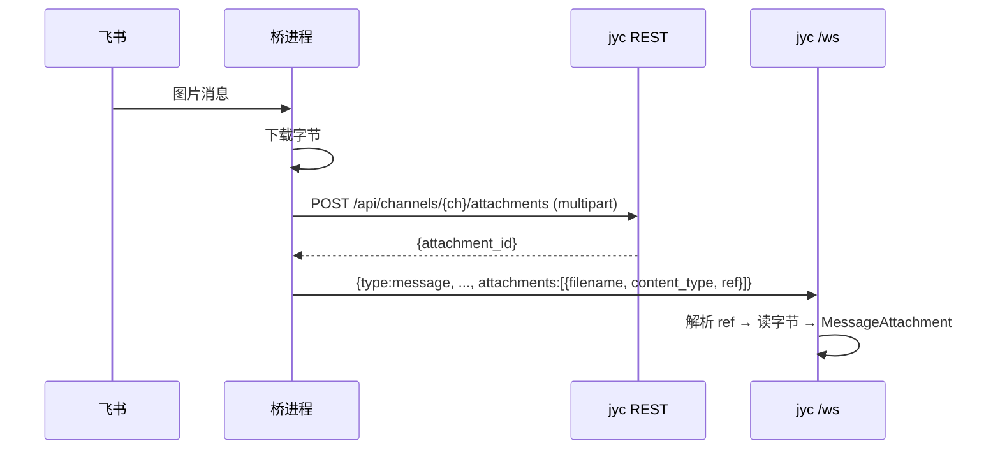
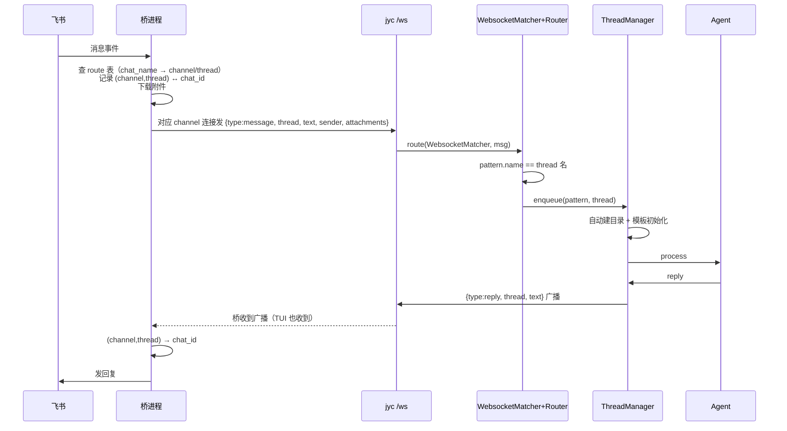
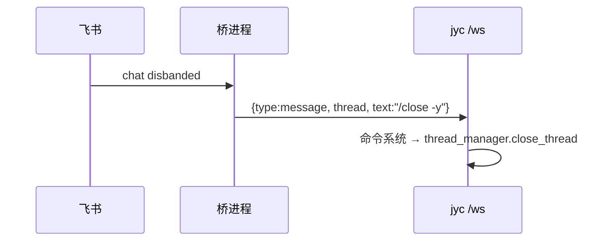

# JYC 插件化架构（Channel Plugin Architecture）

> 状态：设计提案（Draft）— 尚未实现

## 1. 动机

今天所有 channel 都编译进同一个二进制，`jyc-cli` 用两个硬编码的 `match channel_type` 装配
（`build_outbound_adapter` + `InboundSpawner::spawn`，约 950 行）。结果是：core 二进制绑定
openlark / lettre / mail-parser / wechat crypto 等全部依赖；新增 channel 要重编、重启；
channel 只能用 Rust 写。

目标：**把 channel 从 core 里剥成独立进程（bridge / plugin）**，channel 与 jyc、甚至与 Rust
解耦。core 只保留一种 channel（WebSocket），其它 channel 通过桥进程把消息 forward 进 WS、
再把回复 relay 回原生端。

## 2. 设计决策总览

| # | 决策 | 结论 |
|---|------|------|
| 1 | 传输层 | WS（复用 inspect server 的 `/ws/<channel>`；同端口挂 REST 附件） |
| 2 | core 与 channel 解耦 | core 完全 channel 无关，所有桥 channel 一律 `type = "websocket"`；只用 `WebsocketMatcher`（按 thread 名匹配） |
| 3 | 线上内容 | 只传 `thread / text / sender / sender_address / attachments`；路由输入（chat_name 等）不上线 |
| 4 | 路由 | 桥 config 的 route 表：`channel原生身份 → (channel, thread)`；响应过滤（mentions/keywords/sender）是 route 附加条件 |
| 5 | 桥持有状态 | 原生 ID、token、去重、重连、route 表、`(channel,thread) ↔ chat_id` 映射全留桥 |
| 6 | 附件 | REST + multipart 上传/下载，WS 只传 `attachment_id` 引用 |
| 7 | 线程关闭 | 复用 `/close -y` 命令，桥发 WS 消息触发，零新协议 |
| 8 | repo_group 软链 | **不支持**，不进 bridge 模型 |
| 9 | 跨线程/主动发消息 | 已在 ThreadManager 层、channel 无关，零改动 |
| 10 | 桥生命周期 | MVP 外部管理 → 可选 jyc-spawn（`command`），配置形状对齐 MCP Local/Remote |
| 11 | 鉴权 | spawn 桥 token 走 env 自动注入；外部桥读 token 文件 |
| 12 | 日志 | spawn 桥 → `<data_home>/bridges/<name>.log`；外部桥 → 归 supervisor |
| 13 | 发现 | `~/.config/jyc/bridges/<name>/config.toml` 清单自动扫描，按 channel 集合匹配 |
| 14 | repo | `bridges/` 目录 + 单向依赖（桥不 link core） |
| 15 | 试点 | 先 Rust 剥 feishu，再谈非 Rust 与其它 channel |

## 3. 架构总览

```mermaid
flowchart LR
    subgraph ext["外部平台"]
        FS["Feishu / GitHub / WeCom ..."]
    end
    subgraph bridge["桥进程（独立部署，任意语言）"]
        B["bridge<br/>原生协议 ⇄ WS 消息"]
        RT["route 表<br/>chat_name → (channel, thread)"]
        ST["本地状态<br/>原生ID / token / 去重 / 重连<br/>(channel,thread)↔chat_id"]
    end
    subgraph jyc["jyc core（单进程）"]
        WS["inspect server<br/>/ws/<channel> 消息 + /api REST 附件"]
        MR["WebsocketMatcher + MessageRouter"]
        TM["ThreadManager"]
        AI["Agent"]
    end
    FS <-->|原生协议| B
    B --- RT
    B --- ST
    B <-->|WS: {thread, text, sender, attachments}| WS
    WS --> MR --> TM --> AI
```

**边界**：桥把「channel 原生世界」压缩成「thread 名 + 正文 + 发送者 + 附件引用」发给 jyc；
jyc 把「回复 + thread 名」广播回桥；桥用 `(channel, thread) ↔ chat_id` 展开回原生世界。
**路由决策在桥，core 不认识任何 channel 原生概念。**

## 4. 核心概念

- **Bridge / Plugin**：一个说 WS + JSON + multipart 的普通 WS 客户端。不注册、不发现，
  契约就是 WS 协议，与语言无关。
- **route 表（桥 config）**：`channel原生身份 → (channel, thread)` 的显式映射。桥查表决定
  「要不要转发、转发到哪个 jyc channel 的哪个线程」。路由输入（chat_name 等）只在桥内
  消费，永不上线。
- **core 完全 channel 无关**：桥 channel 一律 `type = "websocket"`，`WebsocketMatcher` 只按
  thread 名匹配 pattern（pattern 名 = 线程名）。没有 feishu/github 专属 matcher、没有
  `transport` 标记。
- **thread 名是关联键**：`channel` 由连接（URL `/ws/<channel>`）决定，`thread` 由每条消息
  payload 决定（一条连接承载多线程）。回复按 `thread` 广播，桥映射回原生地址。
- **线程目录自动创建**：thread 不存在时，第一条消息即建目录（`ThreadManager` 层，channel
  无关，见 `thread_manager/queue.rs` 的 `create_dir_all`）。**桥无需 create 原语。**

## 5. Wire 协议

### 5.1 入站（桥 → jyc）

桥对 route 表里出现的每个不同 `channel` 各开一条 `/ws/<channel>` 连接（channel 作用域，
不进 payload）；每条消息在 payload 里带 `thread`（一条连接承载该 channel 的多个线程）：

```json
{
  "type": "message",
  "thread": "thread-xxx",
  "text": "帮我改个配置",
  "sender": "张三",
  "sender_address": "ou_abc",
  "attachments": [{"filename": "a.png", "content_type": "image/png", "ref": "att_1"}]
}
```

- `channel`：由连接（URL）决定，不在 payload 里。
- `thread`：在 payload 里（一条连接多线程）；`WebsocketMatcher` 按它匹配 pattern。
- 全部 optional。dashboard 的 chat pane 只发 `{type:"message", thread, text}`（最小编码）。
- 缺失字段 = 该维度不生效；`sender`/`sender_address` 缺省为 `"user"`/连接地址。

### 5.2 出站（jyc → 桥）

```json
{
  "type": "reply",
  "thread": "thread-xxx",
  "text": "已改好",
  "attachments": [{"filename": "out.pdf", "content_type": "application/pdf", "ref": "att_9"}]
}
```

广播按 `thread` 关联。桥收到后查 `(channel, thread) ↔ chat_id` 逆向映射，发回原生端。
**一个 channel 一条桥连接**（外加任意数量的 dashboard/TUI 观察者，都是普通 WS 客户端）。

### 5.3 TUI chat pane 与桥共享线程

`type = "websocket"` 后，TUI 和桥都是同一 channel 的普通 WS 客户端、共享同一线程命名空间。
TUI 在某个 thread 输入 → core agent 处理 → 回复广播给**所有**订阅者（桥 + TUI）→ 桥把该
thread 的回复发回原生端。因此 TUI 可以旁路介入飞书对话，不只是旁观。

## 6. 路由与响应策略（全在桥）

桥 config（`~/.config/jyc/bridges/feishu/config.toml`）持有 route 表：

```toml
name = "feishu"
channel = "feishu_bot"      # 默认 channel（route 未写 channel 时兜底）
command = ["feishu-bridge"]
app_id = "cli_xxx"
app_secret = "xxx"

[[routes]]
chat_name = "greenfield"    # channel 原生身份（key 随桥实现：chat_name/chat_id/repo/user…）
channel = "channel-b"       # 路由到 jyc channel-b
thread = "thread-xxx"       # 线程名 = jyc pattern 名

[[routes]]
chat_name = "invoice"
channel = "channel-a"
thread = "invoice-processing"
mentions = ["jyc"]          # 可选：只在 @到 bot 时转发（响应过滤）
# keywords = ["发票"]       # 或按关键词过滤
```

- **入站**：原生事件 → 按 `chat_name`（或其它 key）查 route → 命中则把正文翻译成 WS 消息
  发到对应 channel 的连接；不命中就不转发（或走默认策略）。
- **出站**：转发入站时记录 `(channel, thread) ↔ chat_id`；收到 reply 广播按 `(channel, thread)`
  查表发回原生端。
- **响应过滤**：`mentions` / `keywords` / `sender` 是「要不要响应」的条件，作为 route 的
  附加条件（或全局响应策略），同样只在桥 config，不进 jyc。

## 7. 附件流（REST + 引用）



- 二进制走 multipart（Slack / Discord / Telegram / 飞书同款），WS 只传引用。
- 出站方向对称：jyc 广播 `ref`，桥 `GET /api/channels/{ch}/attachments/{id}` 下载再上传飞书。
- 不 base64 塞 WS：避免队头阻塞 + 33% 膨胀 + 中文文件名 header 编码坑。

## 8. 端到端生命周期



## 9. 线程关闭



复用现有 `/close` 命令（需 `-y` / `--confirm` 确认，见 `jyc-core/src/command/close_handler.rs`），
协议零改动。

## 10. 配置

### 10.1 jyc config.toml（无 channel 专属概念）

```toml
[channels.channel-a]
type = "websocket"            # 桥 channel 一律 websocket

[[channels.channel-a.patterns]]
name = "invoice-processing"   # 线程名 = pattern 名（WebsocketMatcher 按它匹配）
enabled = true
# template = "invoice"        # 模板/模型等线程级配置照旧
```

**不再有 `rules`**——channel 原生匹配规则全移桥（见第 6 节）。

### 10.2 桥 config.toml（route 表 + 平台凭据）

```toml
# ~/.config/jyc/bridges/feishu/config.toml
name = "feishu"
channel = "feishu_bot"        # 默认 channel
command = ["feishu-bridge"]   # 有则 spawn；无则等外部连接
app_id = "cli_xxx"
app_secret = "xxx"
base_url = "https://open.feishu.cn"

[[routes]]
chat_name = "greenfield"
channel = "channel-b"
thread = "thread-xxx"

[[routes]]
chat_name = "invoice"
channel = "channel-a"
thread = "invoice-processing"
mentions = ["jyc"]
```

**`command[0]` 解析规则（回退链）**：

```
1. 绝对路径（含 /）→ 直接用（如 ["/usr/local/bin/feishu-bridge"]）
2. 否则查 <bridges>/<name>/<command[0]> 是否存在
   ├─ 存在 → 用它（自包含交付：二进制与 config.toml 同目录）
   └─ 不存在 → 第 3 步
3. 交给操作系统按 $PATH 查找（Command::new 默认行为）
   ├─ 命中（/usr/local/bin、~/.cargo/bin …）→ 用它（系统安装 / cargo install）
   └─ 未命中 → 报错「bridge 未找到」
```

三种交付方式都覆盖：tarball 自包含（第 2 步）、系统安装 / `cargo install`（第 3 步）、
显式绝对路径（第 1 步）。第 2 步优先于第 3 步——想绕开桥目录里的同名二进制，用绝对路径即可。

## 11. 生命周期、鉴权与日志

- **spawn 桥**：jyc 启动时扫 `~/.config/jyc/bridges/*/config.toml`；桥的 channel 集合
  （顶层 `channel` + 各 route 的 `channel`）与任一启用的 ws channel 有交集则 spawn。
  - token 走 env 自动注入（jyc 内存里已有，`serve/mod.rs` 启动时 `generate_token()`）。
  - stdout/stderr → `<data_home>/bridges/<name>.log`（照抄 dashboard→serve 的
    `log_file` 重定向，`jyc-cli/src/cli/dashboard/mod.rs:282`）。
  - 崩溃带退避重启；关闭 `kill_on_drop`。
- **外部桥**：无 `command`，jyc 只等连接；桥自己读 token 文件（`token_path(workdir)`）
  或 `jyc token show`；日志归外部 supervisor（systemd journal / docker logs）。
- 配置形状对齐 MCP 的 `Local{command, environment}` / `Remote{url}`。
- 只 spawn「channel 集合匹配某个启用 ws channel」的桥，不无条件执行目录里的可执行文件。

## 12. 发现：`~/.config/jyc/bridges/`

照搬 skills / templates 的发现模式（`jyc-utils/src/paths.rs` 已有
`global_skills_dir()` / `global_templates_dir()`）：

```
~/.config/jyc/bridges/
  feishu/
    config.toml        # 桥清单（见第 10.2 节）
    feishu-bridge      # 可执行文件（可选）
  github/
    config.toml
```

- 启动时扫 `bridges/*/config.toml`，按 channel 集合匹配启用的 ws channel。
- 只放 L1（`~/.config/jyc`）+ 可选 L2（workdir），不下到 L3（thread）——bridge 是
  「安装的能力」，不是线程级配置。

## 13. Repo 结构与 Build / Deliver

```
jyc/
├─ Cargo.toml               # members = ["crates/*", "bridges/*"]
├─ crates/
│  ├─ jyc-types             # + wire 协议类型（thread/text/sender/attachments）
│  ├─ jyc-bridge-client     # 新增：WS 客户端 + auth + 帧编解码（所有桥共享）
│  ├─ jyc-channels          # 剩余编译进 core 的 channel（email / wecom / …）
│  └─ jyc-core / jyc-agent / jyc-services / jyc-cli / jyc-inspect …
└─ bridges/
   └─ feishu/               # bin "jyc-bridge-feishu"，复用 openlark
```

- **单向依赖**：桥只依赖 `jyc-types` + `jyc-utils` + `jyc-bridge-client`，**绝不依赖
  `jyc-core` / `jyc-services` / `jyc-agent` / `jyc-cli`**。这是解耦的硬保证——feishu
  移走后 openlark 跟着挪走，`jyc` 主二进制立刻瘦身。
- **Build**：Rust 桥是 workspace 成员，`cargo build -p jyc-bridge-feishu` 出独立二进制；
  `jyc` 与桥是两个独立 target。非 Rust 桥不进 workspace，对 jyc 只是 `command` 指向的
  外部二进制/脚本。
- **Deliver**：交付物 = 二进制 + `config.toml` 清单 → `~/.config/jyc/bridges/<name>/`。
  通道：`cargo install` / release tarball / docker image（远程桥）。

## 14. 铺开计划

1. **Step 1（前置，真正剥离前先做）**：REST 附件端点（multipart 上传/下载）+ WS 入站/出站
   附件引用 + `sender` / `sender_address` 字段。
2. **Step 2**：剥 feishu 成 Rust WS 桥（route 表 + `/ws/<channel>` 连接），删 `channels.rs`
   两个 feishu arm。
3. **Step 3（可选）**：非 Rust 语言写个最小插件做语言中立冒烟。
4. **Step 4**：据试点教训决定其余 channel（email 可能因可靠性留下，github/gitee/wecom
   视情况剥离）。

## 15. 待定问题

1. **`number` 字段**：github 桥的线程名 `issue-{N}` / `pr-{N}` 由桥派生（route 表输出 thread）
   还是由 core 派生——若由桥派生，`number` 也只留桥内。等做 github 桥时定。
2. **chat_name 查不到（名称 API 失败）时的回退**：桥提供可读 thread 名，还是回退到
   `chat_id` 形式的 thread 名——桥内决策。
3. **route 不命中时的默认策略**：静默丢弃，还是转发到默认 channel/thread，或回复「无法处理」
   ——按桥各自的行为约定，文档不强制。
